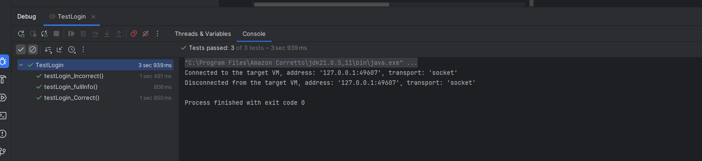

# Đề bài
Mỗi sinh viên dùng câu nhắc sau để có bài tập riêng của mình tương tự mẫu này (Links to an external site.). Có thể chọn ngôn ngữ lập trình khác.

> Cho tôi một bài tập cho sinh viên học môn kiểm thử về kiểm thử tự động với selenium

Chú ý: đưa sản phẩm lên GitHub, viết readme.md, nhờ ChatGPT chấm trước khi nộp lên LMS.

Link Chatgpt: [here](https://chatgpt.com/share/67847d4e-0cdc-8000-98c9-802115953cec)

# Test code
[TestLogin.java](src/test/java/TestLogin.java)

```java
import org.junit.jupiter.api.*;
import org.openqa.selenium.By;
import org.openqa.selenium.JavascriptExecutor;
import org.openqa.selenium.WebDriver;
import org.openqa.selenium.chrome.ChromeDriver;
import org.openqa.selenium.chrome.ChromeOptions;
import org.openqa.selenium.support.ui.ExpectedConditions;
import org.openqa.selenium.support.ui.WebDriverWait;

import java.time.Duration;

import static org.junit.jupiter.api.Assertions.*;

public class TestLogin {

    public static WebDriver driver;
    private static WebDriverWait wait;

    @BeforeAll
    static void setUpBeforeClass() {
        ChromeOptions options = new ChromeOptions();
        options.setBinary("C:\\Program Files\\BraveSoftware\\Brave-Browser\\Application\\brave.exe");
        options.addArguments("--remote-allow-origin**");

        System.setProperty("webdriver.chrome.driver", "D:\\chromedriver-win64\\chromedriver.exe");

        driver = new ChromeDriver(options);
        wait = new WebDriverWait(driver, Duration.ofSeconds(10));
        driver.get("http://localhost:3000/login");
    }

    @AfterAll
    static void tearDownAfterClass() {
        if (driver != null) {
            driver.quit();
        }
    }

    @BeforeEach
    void setUp() throws Exception {
        driver.manage().deleteAllCookies();

        ((JavascriptExecutor) driver).executeScript("window.localStorage.clear();");

        // Clear sessionStorage
        ((JavascriptExecutor) driver).executeScript("window.sessionStorage.clear();");
    }

    @Test
    public void testLogin_fullInfo() {
        driver.get("http://localhost:3000/login");

        wait.until(ExpectedConditions.visibilityOfElementLocated(By.xpath("//*[@id=\"root\"]/div/div[2]/div[2]/form/div[1]/div/div/div/div/input")));

        var username = driver.findElement(By.xpath("//*[@id=\"root\"]/div/div[2]/div[2]/form/div[1]/div/div/div/div/input"));
        var password = driver.findElement(By.xpath("//*[@id=\"root\"]/div/div[2]/div[2]/form/div[2]/div/div/div/div/span[2]/input"));
        var btn = driver.findElement(By.xpath("//*[@id=\"root\"]/div/div[2]/div[2]/form/div[3]/button"));

        assertNotNull(username);
        assertNotNull(password);
        assertNotNull(btn);
    }

    @Test
    public void testLogin_Correct() {
        driver.get("http://localhost:3000/login");

        wait.until(ExpectedConditions.visibilityOfElementLocated(By.xpath("//*[@id=\"root\"]/div/div[2]/div[2]/form/div[1]/div/div/div/div/input")));

        driver.findElement(By.xpath("//*[@id=\"root\"]/div/div[2]/div[2]/form/div[1]/div/div/div/div/input")).sendKeys("american_bankadmin");
        driver.findElement(By.xpath("//*[@id=\"root\"]/div/div[2]/div[2]/form/div[2]/div/div/div/div/span[2]/input")).sendKeys("Amb2024@2024@2024");
        driver.findElement(By.xpath("//*[@id=\"root\"]/div/div[2]/div[2]/form/div[3]/button")).click();

        wait.until(ExpectedConditions.visibilityOfElementLocated(By.xpath("//*[@id=\"root\"]/div/div/header/span[2]/div")));
        assertEquals("http://localhost:3000/home", driver.getCurrentUrl());

    }

    @Test
    public void testLogin_Incorrect() {
        driver.get("http://localhost:3000/login");

        wait.until(ExpectedConditions.visibilityOfElementLocated(By.xpath("//*[@id=\"root\"]/div/div[2]/div[2]/form/div[1]/div/div/div/div/input")));

        driver.findElement(By.xpath("//*[@id=\"root\"]/div/div[2]/div[2]/form/div[1]/div/div/div/div/input")).sendKeys("american_11bankadmi121n");
        driver.findElement(By.xpath("//*[@id=\"root\"]/div/div[2]/div[2]/form/div[2]/div/div/div/div/span[2]/input")).sendKeys("Amb2024@2024@12");
        driver.findElement(By.xpath("//*[@id=\"root\"]/div/div[2]/div[2]/form/div[3]/button")).click();

        wait.until(ExpectedConditions.visibilityOfElementLocated(By.xpath("//*[@id=\"root\"]/div/div[2]/div[2]/form/div[1]/div")));

        var element = driver.findElement(By.xpath("//*[@id=\"root\"]/div/div[2]/div[2]/form/div[1]/div"));

        assertNotNull(element);
    }
}
```

# Kết quả
